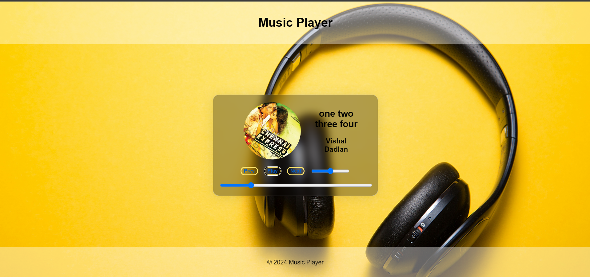

**Responsive Music Player**
==========================

A simple music player built with HTML, CSS, and JavaScript.

**Features**
------------

* Responsive design for a great user experience on desktop and mobile devices
* Displays track information, including album art, title, and artist
* Controls for playing, pausing, and skipping tracks
* Volume control with a range slider
* Progress bar with a range slider to seek through the track

**Files and Folders**
---------------------

* `index.html`: The main HTML file for the music player
* `styles.css`: The CSS file for styling the music player
* `scripts.js`: The JavaScript file for adding interactivity to the music player
* `default.jpg`: A default album art image (replace with your own image)

**Getting Started**
-------------------

1. Open the `index.html` file in a web browser to see the music player in action

**Screenshots**
--------------

